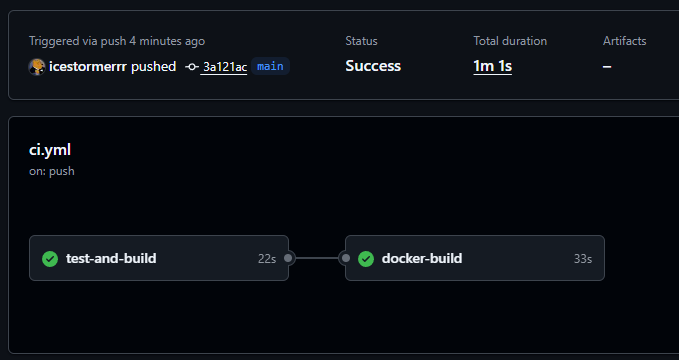

# Практическая работа № 24

Студент: Юркин В.И.

Группа: ПИМО-01-25

Тема: Настройка GitHub Actions для деплоя приложения

Цель: Освоить основы CI/CD для backend-проекта на Go, научиться настраивать автоматический pipeline для проверки, сборки, упаковки Docker-образа и подготовки приложения к доставке

## Что реализовано

- минимальный `tasks` сервис на Go с маршрутом `GET /health`
- unit-тест для обработчика, чтобы pipeline запускал не пустой `go test`
- `Dockerfile` с multi-stage build
- `.dockerignore` для чистого build context
- `docker-compose.yml` для локального запуска контейнера
- простой pipeline для GitHub Actions в `.github/workflows/ci.yml`

## Структура

```text
tech-ip-sem2-cicd/                    - корень проекта практической работы
├── .github/
│   └── workflows/
│       └── ci.yml                    - pipeline GitHub Actions
├── services/
│   └── tasks/                        - сервис, который проверяется и собирается в CI
│       ├── cmd/
│       │   └── tasks/
│       │       └── main.go           - точка входа HTTP-сервиса
│       ├── internal/
│       │   └── httpapi/
│       │       ├── handler.go        - health handler
│       │       └── handler_test.go   - unit-тест handler
│       ├── .dockerignore             - исключения из build context
│       ├── Dockerfile                - multi-stage сборка Docker-образа
│       └── go.mod                    - Go-модуль сервиса
├── deploy/
│   └── docker-compose.yml            - локальный запуск контейнера через Compose
└── README.md                         - описание практики и шагов pipeline
```

## Локальная проверка перед CI

Из каталога `services/tasks`:

```powershell
go test ./...
go build ./...
docker build -t techip-tasks:0.1 .
```

## Локальный запуск контейнера

```powershell
docker run --rm -p 8082:8082 -e TASKS_PORT=8082 techip-tasks:0.1
```

Проверка:

```powershell
Invoke-WebRequest `
  -Uri "http://localhost:8082/health" `
  -Method Get
```

Ожидаемый ответ:

```json
{"status":"ok","service":"tasks"}
```

## Pipeline GitHub Actions

`ci.yml` содержит два job:

### 1. test-and-build

Этот job:
- получает код репозитория
- настраивает Go 1.23
- выполняет `go mod tidy`
- запускает тесты
- выполняет сборку приложения

### 2. docker-build

Этот job:
- запускается только после успешного `test-and-build`
- настраивает Docker Buildx
- собирает Docker-образ сервиса

## Тег Docker-образа

В GitHub Actions используется:

```text
${{ github.sha }}
```

В GitLab CI используется:

```text
$CI_COMMIT_SHORT_SHA
```

Это позволяет точно понимать, какая версия приложения собрана.

## Пример пайплайна

